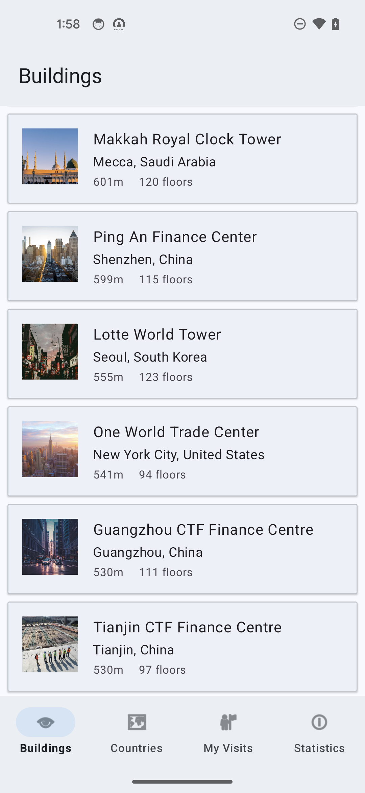
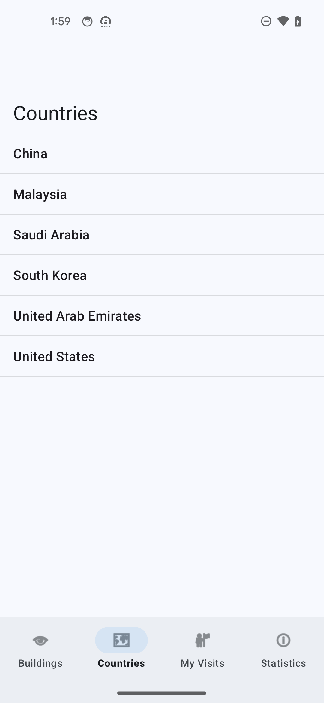
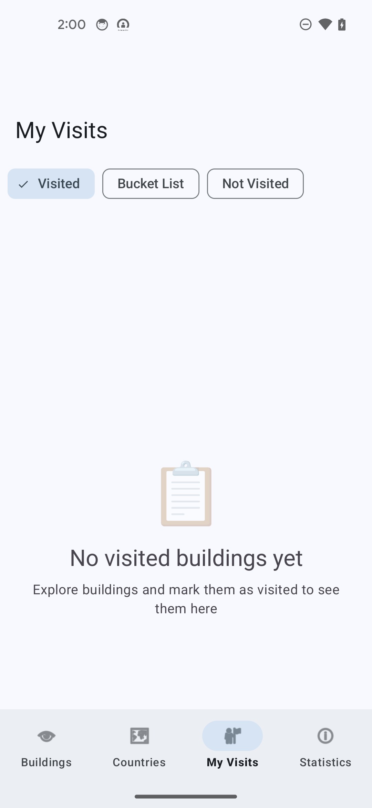
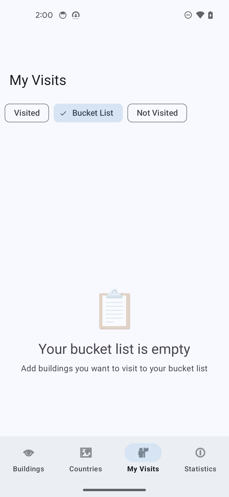
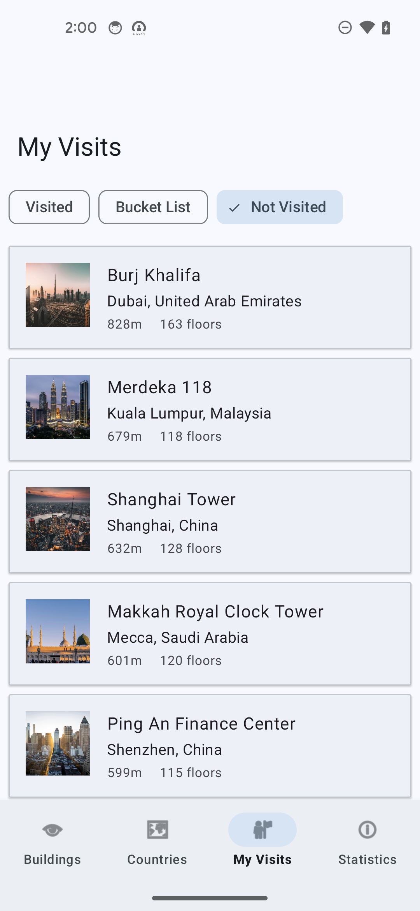
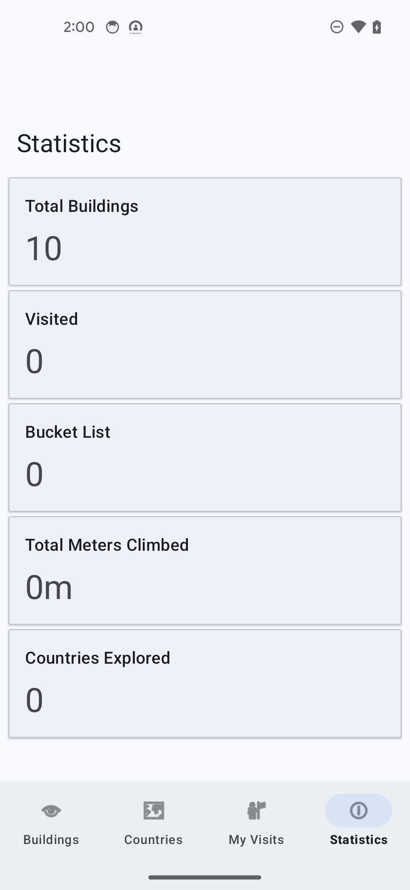
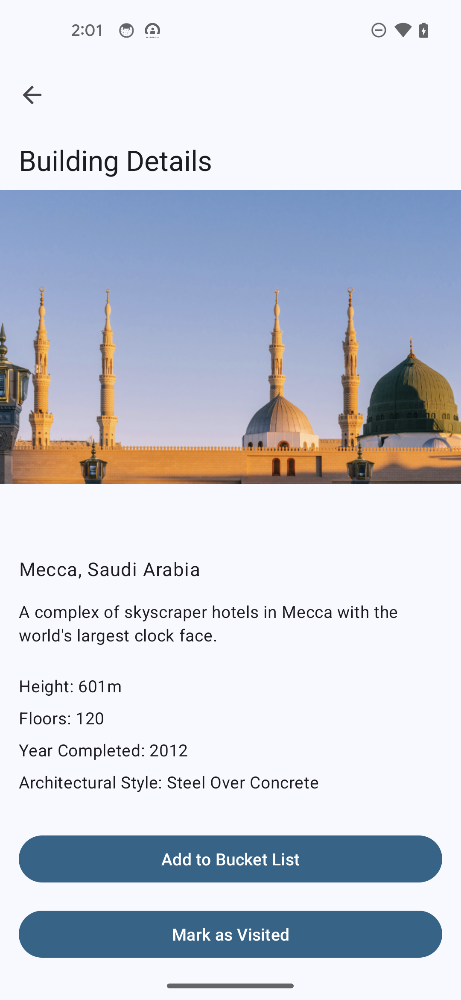

# Spire - Building Explorer

A travel companion Android app that helps users explore famous buildings around the world. Users can browse buildings, view detailed information, track their visits, and maintain a bucket list of buildings they want to see.

## Project Overview


|  |  |  |
| ------ | ----- | ------- |
|  |  |  |
|  |  |  |


This project demonstrates modern Android development practices and architectural patterns for the Udacity Android Nanodegree program. You will build a complete application that showcases:

- **MVVM Architecture** - Separation of concerns with ViewModels, LiveData, and Flow
- **Room Database** - Normalized relational database with foreign keys and indices
- **Repository Pattern** - Offline-first data management strategy
- **Paging3 Library** - Efficient pagination for large datasets
- **Error Handling** - Comprehensive error management with Result wrapper and Event pattern
- **Navigation Component** - Type-safe navigation with Safe Args
- **Coroutines** - Asynchronous operations with proper lifecycle management

## Core Features

### User-Facing Features
- **Browse Buildings** - Scroll through a paginated list of famous buildings worldwide
- **Building Details** - View comprehensive information including height, floors, year completed, and architectural style
- **Visit Tracking** - Mark buildings as Visited, Bucket List, or Not Visited
- **My Visits** - Filter and view buildings by visit status using chip filters
- **Countries Explorer** - Browse unique countries with buildings
- **Statistics Dashboard** - Track your progress with aggregated statistics:

  - Total buildings available
  - Buildings visited count
  - Bucket list count
  - Total meters climbed (sum of visited building heights)

### Technical Features
- **Offline-First** - All data cached locally, works without internet
- **Empty States** - Contextual feedback when lists are empty
- **Loading States** - Progress indicators during data loading
- **Error Messages** - User-friendly error feedback via Snackbar
- **Swipe to Refresh** - Pull-to-refresh on list screens
- **Configuration Change Handling** - Data survives screen rotations

## Getting Started

Instructions for how to get a copy of the project running on your local machine.

### Dependencies


```gradle

// Core Android
androidx.core:core-ktx
androidx.appcompat:appcompat
com.google.android.material:material

// Navigation
androidx.navigation:navigation-fragment-ktx
androidx.navigation:navigation-ui-ktx

// Room Database
androidx.room:room-runtime
androidx.room:room-ktx
androidx.room:room-paging

// Retrofit
com.squareup.retrofit2:retrofit
com.squareup.retrofit2:converter-gson

// Coroutines
org.jetbrains.kotlinx:kotlinx-coroutines-core
org.jetbrains.kotlinx:kotlinx-coroutines-android

// Lifecycle Components
androidx.lifecycle:lifecycle-viewmodel-ktx
androidx.lifecycle:lifecycle-livedata-ktx

// Paging 3
androidx.paging:paging-runtime-ktx

// Image Loading
io.coil-kt:coil

```

### Installation

1. **Clone the Repository**
   
   ```bash
 	git clone git@github.com:udacity/cd0636-Android-App-Components-and-Data-Handling-project.git
   cd cd0636-Android-App-Components-and-Data-Handling/project/solution
   ```

2. **Open in Android Studio**
    
    - Launch Android Studio
    - Select "Open an Existing Project"
    - Navigate to the `starter` directory
    - Wait for Gradle sync to complete


3. **Build the Project**
   
   ```bash
   ./gradlew build
   ```

## Testing

**Unit Tests:**

Run all the unit tests in the app.

```bash
./gradlew test
```

**Instrumented Tests:**

Run all the instrumented tests in the app. Requires an Android device of emulator.

```bash
./gradlew connectedAndroidTest
```

**Test with Coverage:**

Run all unit tests in the app with coverage.

```bash
./gradlew testDebugUnitTestCoverage
```


## Project Instructions

In this project, you will build **Spire**, a travel companion app that helps users explore famous buildings around the world. Users can browse buildings, view detailed information, track their visits, and maintain a bucket list of buildings they want to see.

### Learning Objectives

By completing this project, you will demonstrate your ability to:

- Design and implement a normalized relational database using Room
- Implement the Repository pattern for data management
- Use Paging3 for efficient list pagination
- Handle errors gracefully throughout the app
- Implement MVVM architecture with ViewModels and LiveData/Flow
- Navigate between screens using the Navigation Component
- Display empty states and loading indicators
- Work with coroutines for asynchronous operations


### What You'll Build

**5 Screens:**
1. **Buildings Screen** - Paginated list of all buildings
2. **Building Detail Screen** - Detailed view with visit status controls (Visited, Bucket List, Not Visited)
3. **My Visits Screen** - Filtered list with chip group to toggle between visit statuses
4. **Countries Screen** - List of unique countries
5. **Statistics Screen** - Aggregated statistics (total buildings, visits, meters climbed)


### Technical Requirements

#### Data Layer

**1. Room Database Implementation**

- Create `SpireDatabase` with three normalized tables:
  - `buildings` table with foreign key to `cities`
  - `cities` table with foreign key to `countries`
  - `countries` table as the root
- Implement proper foreign key constraints (`onDelete`, `onUpdate`)
- Add indices on foreign key columns for performance


**2. DAO Implementation**

Create DAOs with queries for:

- `BuildingDao`: Paging source for buildings, filter by visit status, get building by ID with relationships
- `CityDao`: Get or create city by name and country
- `CountryDao`: Get or create country by name

**3. Repository Pattern**

- Implement `BuildingRepository` with offline-first architecture
- Use `Result<T>` wrapper for operations that can fail
- Return `Flow<PagingData<Building>>` for paginated building list
- Return `Flow` or `LiveData` for other data sources
- Use coroutines with proper dispatchers (`Dispatchers.IO` for DB/network)

#### UI Layer

**1. ViewModels** (5 ViewModels - one per screen)

- Expose data as `LiveData` or `Flow`
- Implement error handling with Event wrapper pattern
- Use `viewModelScope` for coroutine launches
- Handle loading states appropriately

**2. Fragments** (5 Fragments)

- Use View Binding for type-safe view access
- Set up RecyclerView with appropriate adapters
- Observe ViewModel data and update UI
- Display error messages via Snackbar
- Implement empty states for list screens
- Use Navigation Component with Safe Args

**3. Adapters**

- Create `BuildingPagingAdapter` for paginated list
- Create `BuildingAdapter` for filtered lists
- Implement `BuildingLoadStateAdapter` for loading/error footer
- Use DiffUtil for efficient updates

#### Error Handling

**1. Repository Level**

- Wrap network/database operations in try-catch
- Return `Result.success()` or `Result.failure()`
- Use `.catch` operator for Flow error handling

**2. ViewModel Level**

- Create `ErrorEvent` data class and `Event` wrapper
- Expose error events via `LiveData<Event<ErrorEvent>>`
- Handle `Result` types from repository

**3. UI Level**

- Observe error events in Fragments
- Use `getContentIfNotHandled()` to prevent duplicate display
- Show user-friendly messages via Snackbar

#### Advanced Features

**1. Paging3**

- Use `Pager` with `PagingConfig` in repository
- Connect `BuildingLoadStateAdapter` with `withLoadStateFooter()`
- Handle empty state based on `LoadState`
- Use `cachedIn(viewModelScope)` to preserve state

**2. Empty States**

- Add empty state layouts to all list screens
- Toggle visibility based on data availability
- Show contextual messages based on filter state

**3. Statistics**

- Implement aggregated queries in DAO
- Calculate total buildings, visited count, bucket list count
- Sum total meters climbed from visited buildings


### Submission Requirements

**Your submission must include:**

1. **Complete implementation** of all TODO items in starter code
2. **Proper error handling** in all ViewModels
3. **Empty state UI** for all list screens (Buildings, My Visits, Countries)
4. **Working Paging3** implementation with LoadStateAdapter
5. **Functional navigation** between all screens
6. **App compiles and runs** without crashes
7. **Code follows Kotlin conventions** (proper use of `val`/`var`, null safety, etc.)
8. **Comments explaining complex logic**


**Rubric Checklist:**

- [ ] Room database with normalized schema and foreign keys
- [ ] All DAOs implemented with correct queries
- [ ] Repository returns `Result<T>` for error-prone operations
- [ ] ViewModels expose immutable `LiveData` (not `MutableLiveData`)
- [ ] Error handling with Event wrapper pattern
- [ ] Paging3 with LoadStateAdapter connected
- [ ] Empty states on Buildings, My Visits, and Countries screens
- [ ] Navigation with Safe Args between screens
- [ ] No memory leaks (binding cleaned up in `onDestroyView`)
- [ ] Proper coroutine usage (`viewModelScope`, correct dispatchers)


### How to Start

1. **Clone the starter repository**
2. **Review the provided code:**
   - Entities are pre-defined (`BuildingEntity`, `CityEntity`, `CountryEntity`)
   - Layout files are provided
   - Navigation graph is set up
3. **Follow TODO comments** in the code to implement each feature
4. **Test as you go** - run the app frequently to catch issues early
5. **Refer to solution code** if you get stuck (but try to solve problems independently first)

### Tips for Success

- **Start with the data layer** - Get Room database and DAOs working first
- **Test queries in isolation** - Write unit tests for DAOs
- **Build feature by feature** - Complete one screen fully before moving to the next
- **Use Repository pattern** - Don't call DAOs directly from ViewModels
- **Handle errors everywhere** - Every network/database call can fail
- **Clean up resources** - Set `_binding = null` in `onDestroyView()`
- **Check the rubric frequently** - Make sure you're meeting all requirements


### Resources

- [Room Database Guide](https://developer.android.com/training/data-storage/room)
- [Paging 3 Codelab](https://developer.android.com/codelabs/android-paging)
- [ViewModel Guide](https://developer.android.com/topic/libraries/architecture/viewmodel)
- [Kotlin Coroutines Guide](https://kotlinlang.org/docs/coroutines-guide.html)
- [Navigation Component Guide](https://developer.android.com/guide/navigation)


## Built With

* [Kotlin](https://kotlinlang.org/) - Programming language
* [Android Jetpack](https://developer.android.com/jetpack) - Suite of libraries
* [Room](https://developer.android.com/training/data-storage/room) - Database library
* [Paging 3](https://developer.android.com/topic/libraries/architecture/paging/v3-overview) - Pagination library
* [Retrofit](https://square.github.io/retrofit/) - HTTP client
* [Coroutines](https://kotlinlang.org/docs/coroutines-overview.html) - Async programming
* [Navigation Component](https://developer.android.com/guide/navigation) - Fragment navigation
* [Material Design 3](https://m3.material.io/) - Design system
* [Coil](https://coil-kt.github.io/coil/) - Image loading

## License
[License](../LICENSE.md)